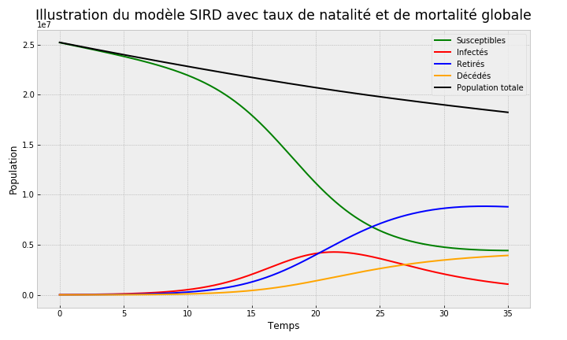

# COVID-19 SIRD MODEL
Study of the COVID-19 epidemic in Cameroon using a SIRD model with population birth and death rates.

Check the file `Rapport.pdf` for a complete description of the work; run the notebook in the folder `Code` to obtain the results.

## Screenshots

 
 

## Resources
- [OpenTurns](https://openturns.github.io/www/index.html)

